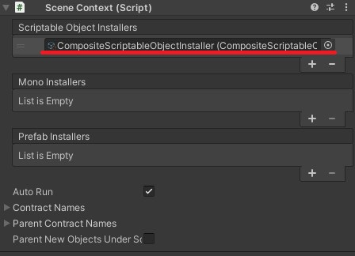

# ExtenjectExtension-CompositeInstaller
Extenject extension for composite pattern installers

## Dependencies
- [Extenject](https://github.com/svermeulen/Extenject)
  - Version 9.2.0 or later

## Installation
- All installations require "Extenject"

### Unity Package Manager
- Use `Assets/Plugins/ExtenjectExtension-CompositeInstaller/package.json`

### unitypackage
- Use `ExtenjectExtension-CompositeInstaller.unitypackage` from [Release Page](https://github.com/tsgcpp/ExtenjectExtension-CompositeInstaller/releases)

## Introduction

### CompositeMonoInstaller
- Add "CompositeMonoInstaller" component to GameObject
- Set some "MonoInstaller"s (including "CompositeMonoInstaller")
- Set "CompositeMonoInstaller" to a Context

### CompositeScriptableObjectInstaller
- Create "CompositeScriptableObjectInstaller" in the same way as other "ScriptableObjectInstaller"s

- Set some "ScriptableObjectInstaller"s (including "CompositeScriptableObjectInstaller")

- Set "CompositeScriptableObjectInstaller" to a Context

### FYI
- If any circular references are found in a composite installer, the property on the inspector will get red as a warning

## License
- See [here](./LICENSE)